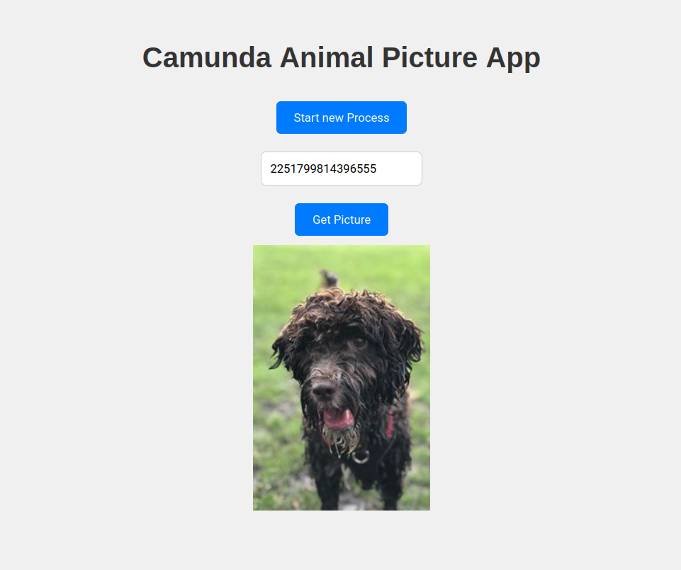
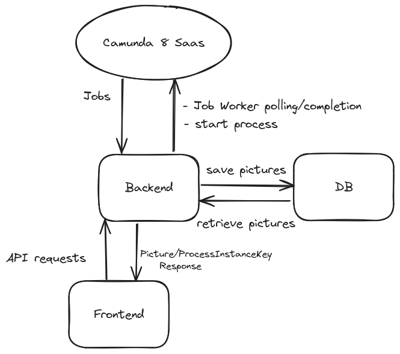

# Getting Started

## Running the Application

### Docker Compose Method

#### Setting up the Environment Variables

Before you start the application, you need to set up the environment variables.
These contain the connection info to your Camunda SaaS Cluster.
This can be done by creating a `.env` file in the root directory of the project.

Here's an example of what your `.env` file should look like:

```env
ZEEBE_CLIENT_CLOUD_REGION=your_region
ZEEBE_CLIENT_CLOUD_CLIENT_ID=your_client_id
ZEEBE_CLIENT_CLOUD_CLIENT_SECRET=your_client_secret
ZEEBE_CLIENT_CLOUD_CLUSTER_ID=your_cluster_id
```

#### Running the application

```
docker compose up -d
```

This starts the Spring Boot client (port 8080), the Angular Frontend (port 4200) and a MongoDB instance to store the pictures.

### Helm Method

#### Setting up the Environment Variables

Before you start the application, you need to set up the environment variables.
These contain the connection info to your Camunda SaaS Cluster.
This can be done by replacing the placeholders in the [configmap file](./helm/templates/home-rido-test-camunda-animal-picture-app--env-configmap.yaml) with your values.

#### Building the Docker Images
If you are using Minikube you need to switch to the Minikube Docker environment:
```
eval $(minikube docker-env)
```

Then you can build the Docker images:

```
docker compose build
```

#### Deploying the Application

```
helm install camunda-animal-picture-app ./helm
```

This will deploy the application to your Kubernetes cluster.  
Again you can access the Spring Boot client (port 8080) and the Angular Frontend (port 4200).
If you are using Minikube, you can find the IP address with:

```
minikube ip
```

OR

you can port-forward the services to your local machine:

```
kubectl port-forward <frontend-pod> 4200:4200
kubectl port-forward <backend-pod> 8080:8080
```

## Usage

### REST API

Starting a new process (returns processInstanceKey):

```
POST localhost:8080/animal-picture-process
```

Bash:

```
curl -X POST localhost:8080/animal-picture-process
```

After completing the User Task, the Job Worker will start retrieving the picture from the API and store it in the DB.

To retrieve the picture (e.g. in your browser):

```
GET localhost:8080/animal-picture-process/{processInstanceKey}
```

### Frontend

Navigate to `http://localhost:4200` to see the Angular Frontend.  
Here you can start a new process and the text field will get filled with the processInstanceKey automatically.  
After completing the User Task, you can click on the "Get Picture" button to retrieve the picture.


# Simplified Architecture
<!-- add png -->


# Limitations

## Camunda Saas

For now the application can only be configured to work with the Saas offering from Camunda.  
If you want the app to work with your self-managed instance, you would need to adjust the [application.yaml](./backend/src/main/resources/application.yaml) file accordingly.

## Docker Mac Slow Filesystem

If you are using Docker on a Mac, you might experience slow file system performance, and even timeouts
when Docker is on the `npm install` step. To mitigate this, you can run `npm install` on your host machine first in the `frontend` directory.
